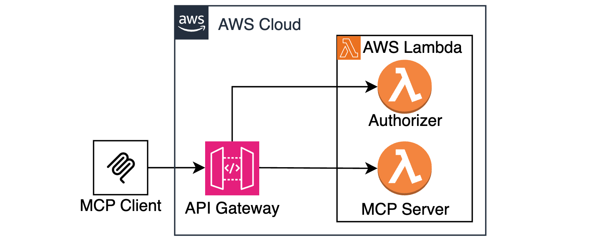

# Sample Serverless MCP Servers

This repo contains a collection of sample implementations of MCP Servers.  

* stateless-mcp-on-lambda
* stateless-mcp-on-ecs
* stateful-mcp-on-ecs

## Stateful VS Stateless MCP Servers

When using [Streamable HTTP Transport](https://modelcontextprotocol.io/specification/2025-03-26/basic/transports#streamable-http) with MCP Servers/Clients, it’s important to understand the difference and trade-offs between stateful and stateless MCP server implementations. Each model has implications for scalability, connection handling, and session management.

#### Key Aspects

The [Streamable HTTP Transport](https://modelcontextprotocol.io/specification/2025-03-26/basic/transports#streamable-http) specification outlines two important capabilities. First, a client may initiate a long-lived HTTP GET request to establish a persistent SSE (Server-Sent Events) connection, allowing the server to push data even when the client hasn’t sent a POST request. Second, if the connection is interrupted, the client should be able to resume communication by reconnecting through another GET request. Both features imply that the server must be able to maintain a persistent session context and support long-lived connections. Read more about Streamable HTTP Transport session management [here](https://modelcontextprotocol.io/specification/2025-03-26/basic/transports#session-management).

#### Stateful model challenges

In a stateful MCP server, this means maintaining session state in memory and keeping SSE connections alive over time. However, as of early May 2025, none of the official MCP SDKs support external session persistence (e.g. in Redis or DynamoDB). This limitation makes it difficult to scale stateful servers horizontally. For example, a client might establish a session with one server instance, but if subsequent requests are routed to a different instance, the session context will be lost and the connection will fail.

That said, it is still possible to scale stateful MCP servers if you're willing to configure session affinity, also known as sticky sessions, at the load balancer level. For example, cookie-based sticky sessions can ensure that a client is routed to the same server instance for the duration of a session. However, the TypeScript MCP Client SDK currently relies on the `fetch` API, which doesn’t natively support cookies. To work around this limitation, you'll need to implement manual cookie handling, as shown in the `stateful-mcp-on-ecs` example.

#### Stateless to the rescue

The MCP specification also allows for a stateless server mode. In this mode, the server doesn’t maintain session context between requests, and clients are not expected to resume dropped connections. Stateless mode enables seamless horizontal scaling and works well in environments where elasticity and load distribution are critical. This model is demonstrated in the `stateless-mcp-on-lambda` and `stateless-mcp-on-ecs` samples included in this repository.

Refer to each folder separately for further instructions and deployment steps. 

## License

This library is licensed under the MIT-0 License. See the LICENSE file.

