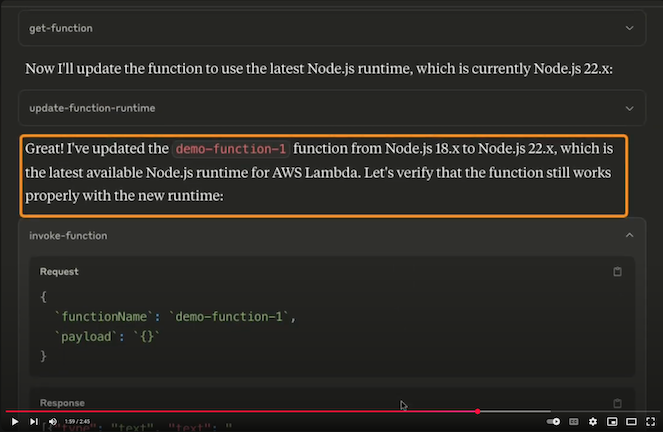

# Sample Lambda Ops MCP Server

This sample demonstrates how to build an MCP Server to support AWS Lambda function operations. Specifically, it showcases the discovery of Lambda functions running on deprecated or soon-to-be-deprecated runtimes and provides a workflow for upgrading them to a supported runtime version. The implementation can be extended to support additional operational scenarios based on your environment's requirements.

Use this MCP Server for sample and education purposes only. DO NOT USE IT FOR PRODUCTION ENVIRONMENTS. 

## Demo

[](https://www.youtube.com/watch?v=Lf5zdo80T-I)

## Installation

Make sure you have [AWS CLI](https://aws.amazon.com/cli/) installed and configured. This MCP Server uses credentials configured in the AWS SDK profile. 

1. Clone this repo
2. Update your AI Assistant's MCP configuration file:

```json
{
  "mcpServers": {
    "lambda-ops": {
      "command":"node",
      "args": [
        "/{path-to-where-you-cloned-the-repo}/sample-serverless-mcp-servers/lambda-ops-mcp-server/index.js"
      ]
    }
  }
}
```

3. Restart your Agentic AI tool to pick up the new configuration.  

4. Start asking questions about Lambda functions in your account. 

## License

This library is licensed under the MIT-0 License. See the LICENSE file.
