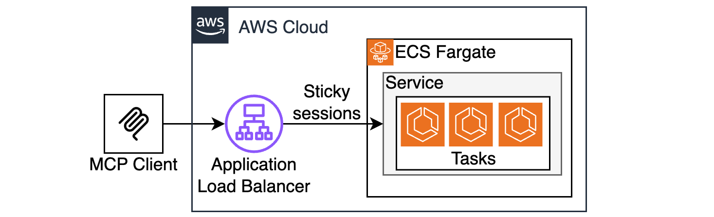

# Stateful MCP Server on ECS Fargate

This is a sample MCP Server running natively on ECS Fargate and ALB without any extra bridging components or custom transports. This is now possible thanks to the [Streamable HTTP](https://modelcontextprotocol.io/specification/2025-03-26/basic/transports#streamable-http) transport introduced in v2025-03-26. 



## Prereqs

* AWS CLI
* Terraform 

## Instructions

### Clone the project

```bash
git clone https://github.com/aws-samples/sample-serverless-mcp-servers.git
cd sample-serverless-mcp-servers/stateful-mcp-on-ecs
```

### Install dependencies

```bash
(cd src/js/mcpclient && npm install)
(cd src/js/mcpserver && npm install)
```

### Тest the server locally

```bash
node src/js/mcpserver/index.js
```

once the server is running, run in a separate terminal window

```bash
node src/js/mcpclient/index.js
```

### Build and upload image to ECR

Update `publish-to-ecr.sh` with your ECR alias, and run the script to build and deploy MCP Server image to ECR. 

```bash
./publish-to-ecr.sh
```

### Deploy to AWS with Terraform

```bash
cd terraform
terraform init
terraform plan
terraform apply
export MCP_SERVER_ENDPOINT=$(terraform output --raw mcp_endpoint) 
cd ..
```

Deployment takes 3-4 minutes. Once Tarraform deployment has completed, it will take 2-3 more minutes for ECS tasks to spin up and get recognized by the ALB target group.

### Test your remote MCP Server with MCP client:
```bash
node src/js/mcpclient/index.js
```

Observe the response:
```bash
Connecting ENDPOINT_URL=http://stateful-mcp-on-ecs-1870111106.us-east-1.elb.amazonaws.com/mcp
connected
listTools response:  { tools: [ { name: 'ping', inputSchema: [Object] } ] }
callTool:ping response:  {
  content: [
    {
      type: 'text',
      text: 'pong! taskId=task/stateful-mcp-on-ecs/6907042c100c4adf80c2d0957c38706f v=0.0.10 d=101'
    }
  ]
}
callTool:ping response:  {
  content: [
    {
      type: 'text',
      text: 'pong! taskId=task/stateful-mcp-on-ecs/6907042c100c4adf80c2d0957c38706f v=0.0.10 d=50'
    }
  ]
}
```

## Statefull vs Stateless considerations
MCP Server can run in two modes - stateless and stateful. This repo demonstrates the stateful mode.

Stateful mode implies a persistent SSE connection established between MCP Client and MCP Server. This connection is used for MCP Server to be able to support resumability and proactively send notifications to MCP Clients. This works fine when you have a single instance of MCP Server running (e.g a single ECS Task). This does not work out-of-the-box if you want to have more than one ECS Task since a session will be established with one task, but subsequent requests may hit a different task. 

As of building this sample (early May 2025), the TypeScript implementation of MCP Server SDK does not support externalizing session info, meaning session cannot be synchronized across different server instances. 

It is possible to address this concern by using ALB with cookie-based sticky sessions, which will insure that requests for a session established with a particular task will always be forwarded to the same task. However, MCP Client SDK does not support cookies by default. To address this concern, this sample is injecting cookie support into `fetch`, the framework MCP Client uses under-the-hood for HTTP communications. 

See more info about this in 
* src/js/mcpclient/index.js
* terraform/ecs.tf

## HTTPS considerations

By default, this sample uses the default ALB endpoint, which is HTTP only. See a comment in terraform/alb.tf for instructions how to enable HTTPS. 

Only use HTTP for testing purposes!!! Never expose ANYTHING via plain HTTP, use HTTPS only!!!

## Cost considerations

This sample provisions paid resources in your account, such as ECS Tasks and ALB. Remember to delete these resources when you're done evaluating.

```bash
terraform destroy
```

## Learn about mcp
[Intro](https://modelcontextprotocol.io/introduction)

[Protocol specification](https://modelcontextprotocol.io/specification/2025-03-26)
