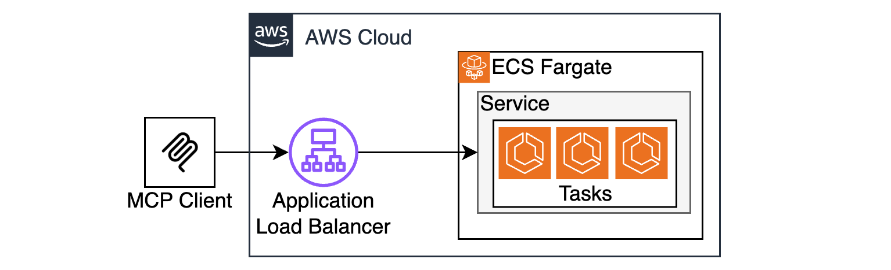

# Stateless MCP Server on ECS Fargate

This is a sample MCP Server running natively on ECS Fargate and ALB without any extra bridging components or custom transports. This is now possible thanks to the [Streamable HTTP](https://modelcontextprotocol.io/specification/2025-03-26/basic/transports#streamable-http) transport introduced in v2025-03-26. 



## Prereqs

* AWS CLI
* Terraform 

## Instructions

### Clone the project

```bash
git clone https://github.com/aws-samples/sample-serverless-mcp-servers.git
cd sample-serverless-mcp-servers/stateless-mcp-on-ecs-nodejs
```

### Install dependencies

```bash
(cd src/mcpclient && npm install)
(cd src/mcpserver && npm install)
```

### Тest the server locally

```bash
node src/mcpserver/index.js
```

Once the server is running, run client in a separate terminal window

```bash
node src/mcpclient/index.js
```

### Build and upload image to ECR

Update `publish-to-ecr.sh` with your ECR alias, and run the script to build and deploy MCP Server image to ECR. 

```bash
./publish-to-ecr.sh
```

### Deploy to AWS with Terraform

Update `terraform/locals.tf` with your ECR alias. Optionally, update region, VPC configuraion, and Route53 Zone Name if you have a DNS name registered to use for SSL certificate (see HTTPS considerations below for details). 

Run below commands to deploy the sample to AWS

```bash
cd terraform
terraform init
terraform plan
terraform apply
export MCP_SERVER_ENDPOINT=$(terraform output --raw mcp_endpoint) 
cd ..
```

Deployment takes 3-4 minutes. Once Terraform deployment has completed, it will take 2-3 more minutes for ECS tasks to spin up and get recognized by the ALB target group.

### Test your remote MCP Server with MCP client:
```bash
node src/mcpclient/index.js
```

Observe the response:
```bash
Connecting ENDPOINT_URL=http://stateless-mcp-on-ecs-1870111106.us-east-1.elb.amazonaws.com/mcp
connected
listTools response:  { tools: [ { name: 'ping', inputSchema: [Object] } ] }
callTool:ping response:  {
  content: [
    {
      type: 'text',
      text: 'pong! taskId=task/stateful-mcp-on-ecs/6907042c100c4adf80c2d0957c38706f v=0.0.10 d=101'
    }
  ]
}
callTool:ping response:  {
  content: [
    {
      type: 'text',
      text: 'pong! taskId=task/stateful-mcp-on-ecs/6907042c100c4adf80c2d0957c38706f v=0.0.10 d=50'
    }
  ]
}
```

## Statefull vs Stateless considerations
MCP Server can run in two modes - stateless and stateful. This repo demonstrates the stateless mode. 

In stateless mode, clients do not establish persistent SSE connections to MCP Server. This means clients will not receive proactive notifications from the server. On the other hand, stateless mode allows you to scale your server horizontally.

If you want to see how to built a stateful MCP Server, that supports persistent SSE connections, see the `stateful-mcp-on-ecs-nodejs` sample in this repo. 

## HTTPS considerations

By default, this sample uses the default ALB endpoint, which is HTTP only. See a comment in terraform/alb.tf for instructions how to enable HTTPS. 

Only use HTTP for testing purposes ONLY!!! NEVER expose ANYTHING via plain HTTP, always use HTTPS!!!

## Cost considerations

This sample provisions paid resources in your account, such as ECS Tasks and ALB. Remember to delete these resources when you're done evaluating.

```bash
terraform destroy
```

## Learn about mcp
[Intro](https://modelcontextprotocol.io/introduction)

[Protocol specification](https://modelcontextprotocol.io/specification/2025-03-26)
