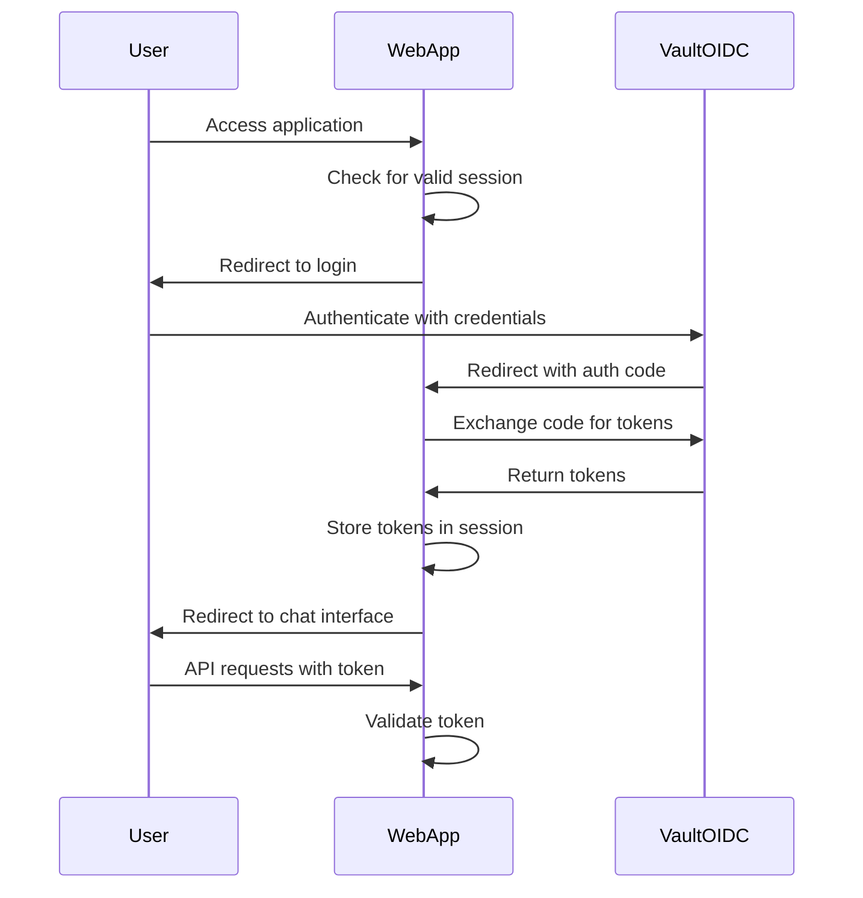

# Design Document: Vault Authentication Integration

## Overview

This design document outlines the approach for reconfiguring the Gradio UI to use HashiCorp Vault for user authentication instead of AWS Cognito. The implementation will leverage Vault's OIDC provider capabilities while maintaining the existing user experience and application flow.

The current system uses AWS Cognito for authentication through OAuth 2.0/OpenID Connect. We will replace this with Vault's OIDC provider while keeping the same authentication flow pattern and session management approach.

## Architecture

The authentication flow will follow the standard OAuth 2.0authorization code flow:

1. User accesses the application
2. Unauthenticated users are redirected to the Vault OIDC authorization endpoint
3. User authenticates with Vault credentials
4. Vault redirects back to our application with an authorization code
5. Our application exchanges the code for access and ID tokens
6. User information is extracted from tokens and stored in the session
7. User is redirected to the chat interface

## Components and Interfaces

### 1. OAuth Configuration Module (`oauth.py`)

This module will be updated to use Vault OIDC instead of Cognito:

- Replace Cognito-specific configuration with Vault OIDC configuration
- Update OAuth client registration to use Vault OIDC endpoints
- Modify token handling to extract user information from Vault tokens
- Update logout flow to properly terminate Vault sessions

### 2. Authentication Middleware

The existing session middleware will be maintained, but the authentication check function will be updated:

- Update token validation to work with Vault tokens
- Ensure proper extraction of username from Vault tokens
- Maintain the same interface for downstream components

### 3. Environment Configuration

New environment variables will be added:

- `VAULT_OIDC_CLIENT_ID`: Client ID for Vault OIDC
- `VAULT_OIDC_CLIENT_SECRET`: Client secret for Vault OIDC
- `VAULT_OIDC_ISSUER`: URL of the Vault OIDC issuer
- `VAULT_OIDC_AUTH_URL`: Authorization endpoint URL
- `VAULT_OIDC_TOKEN_URL`: Token endpoint URL
- `VAULT_OIDC_JWKS_URL`: JWKS endpoint URL
- `VAULT_OIDC_LOGOUT_URL`: Logout endpoint URL

### 4. User Interface

The user interface flow will remain largely unchanged:

- Login redirect will point to Vault instead of Cognito
- Logout button functionality will be updated to use Vault logout endpoint
- Error handling will be updated to handle Vault-specific error messages

## Data Models

### Session Data

The session will store the following authentication data:

- `access_token`: JWT token from Vault OIDC
- `id_token`: ID token containing user information
- `username`: Extracted username from token claims
- `token_expiry`: Expiration time of the token

### Token Claims

Expected claims from Vault OIDC tokens:

- `sub`: Subject identifier (user ID)
- `username` or equivalent: User's username
- `exp`: Token expiration time
- `iat`: Token issuance time
- `iss`: Token issuer (Vault OIDC URL)

## Error Handling

The following error scenarios will be handled:

1. **Authentication Failure**: When users provide invalid credentials, display appropriate error message and allow retry
2. **Token Exchange Failure**: Handle failures during code-to-token exchange with clear error messages
3. **Token Validation Failure**: Detect invalid or expired tokens and redirect to re-authentication
4. **Network Errors**: Handle connectivity issues with Vault OIDC provider
5. **Configuration Errors**: Validate environment variables at startup and provide clear error messages

## Testing Strategy

### Unit Tests

1. Test OAuth configuration with Vault parameters
2. Test token validation and user information extraction
3. Test session management with Vault tokens
4. Test error handling for various authentication failure scenarios

### Integration Tests

1. Test end-to-end authentication flow with Vault OIDC
2. Test token refresh and session management
3. Test logout functionality
4. Test API access with Vault tokens

### Manual Testing

1. Verify login flow with valid credentials
2. Verify login failure with invalid credentials
3. Verify session persistence across page reloads
4. Verify logout functionality
5. Verify token expiration handling

## Security Considerations

1. **Token Storage**: Ensure tokens are only stored in server-side sessions, not in client-side storage
2. **HTTPS**: Ensure all communication with Vault OIDC endpoints uses HTTPS
3. **Token Validation**: Properly validate token signatures and claims
4. **Error Messages**: Ensure error messages don't leak sensitive information
5. **Session Timeout**: Implement appropriate session timeout and token refresh mechanisms

## Implementation Approach

The implementation will follow these steps:

1. Update environment variable configuration
2. Modify OAuth configuration to use Vault OIDC
3. Update token handling and user information extraction
4. Update logout functionality
5. Test authentication flow
6. Update error handling
7. Deploy and monitor

This approach allows for a clean transition from Cognito to Vault while maintaining the existing application structure and user experience.