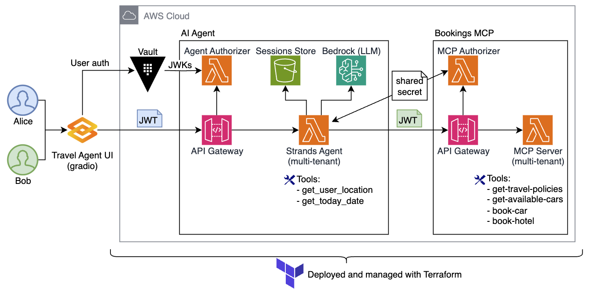
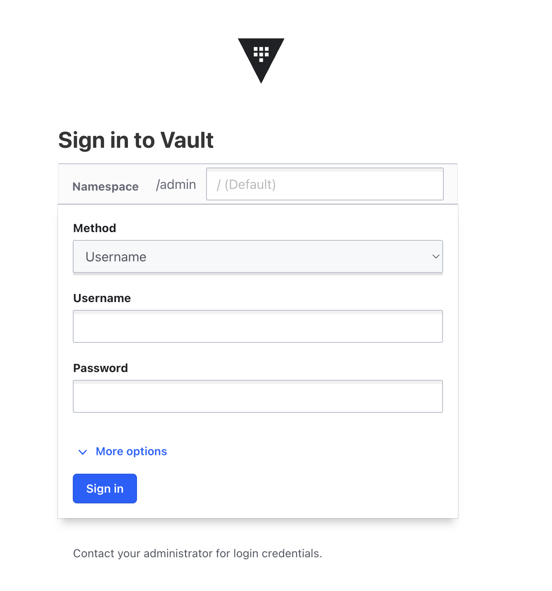
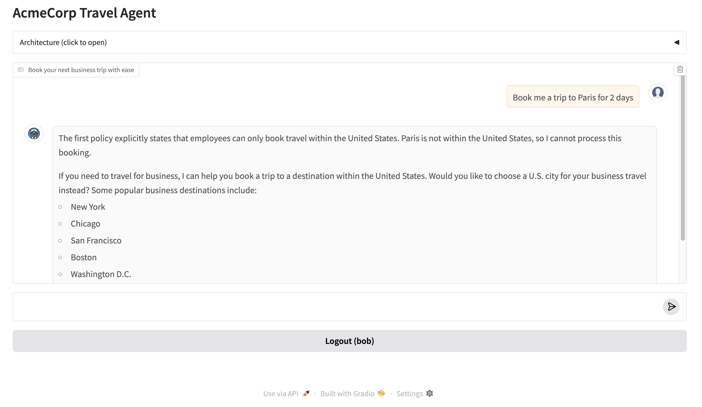

# AI Agent with MCP Server on AWS Lambda

This repo contains a sample implementation of user-aware AI Agent and MCP Server running on [AWS Lambda](https://aws.amazon.com/lambda). The sample implements an AI-based Travel Agent for a fictitious corporation AcmeCorp.


See two below artifacts to better understand the expected Agent behavior. 
* [./lambdas/travel-agent/agent_builder.py](./lambdas/travel-agent/agent_builder.py) for Agent's system prompt. 
* [./lambdas/bookings-mcp/tool-get-travel-policies.js](./lambdas/bookings-mcp/tool-get-travel-policies.js) for corporate travel policies the Agent is bound by. 

(Skip to [Running the project](#running-the-project))



### Frameworks and services
* AI Agent is implemented using [Strands Agents SDK](https://strandsagents.com/0.1.x/)
* MCP Server is implemented using the [official MCP TypeScript SDK](https://github.com/modelcontextprotocol/typescript-sdk) and [Lambda Web Adapter](https://github.com/awslabs/aws-lambda-web-adapter)
* [Amazon API Gateway](https://aws.amazon.com/api-gateway/) is used to front AI Agent and MCP (see architecture diagram). 
* [Amazon S3](https://aws.amazon.com/s3/) is used to persist AI Agent session state. 
* [Amazon Bedrock](https://aws.amazon.com/bedrock) and Claude Haiku 3.5 are used for inference. 
* [Gradio](https://www.gradio.app) is used for Web UI. 

### Authentication and Authorization
* User authentication is handled by [HashiCorp Vault OIDC](https://developer.hashicorp.com/vault/docs/auth/jwt)
* Both AI Agent and Bookings MCP domains require JWT (bearer token) authorization, as enforced by API Gateway Lambda authorizers.
* AI Agent expects JWT issued by Vault OIDC. The subject of this JWT is the user. Validation is done in the Agent Authorizer using JWKs generated by the authentication provider during user authentication.
* Bookings MCP expects JWT generated by Strands Agent. The subject of this JWT is the agent with `user_id` being an extra claim. This token is signed by a shared secret. Validation is done in the MCP Authorizer using shared secret. 
* To state explicitly - at no point in time user's identity is inferred from LLM's response. It is ALWAYS propagated using JWTs. 

### User-awareness and session management
* Both AI Agent and MCP Server are fully stateless, they do not maintain any internal state. 
* Both AI Agent and MCP Server are aware of the current user and process requests within the user authorization context.
* AI Agent externalizes its state to S3, using `user_id` as session identifier. 
* New Strands Agent instance is created on every request with state that belongs to the current user. 
* MCP Clients attached to the AI Agent are created per-user, holding user-specific JWT to communicate with MCP Server. 
* MCP Server propagates authorized user context into all tools, making MCP tools user-aware. 

### Tools

#### Implemented in agent
* [Agent] `get-user-location` resolves user's IP address to users location. 
* [Agent] `get-todays-date` tool returns today's date.

#### Implemented in MCP Server
* [MCP] `get-travel-policies` returns AcmeCorp corporate travel policies.
* [MCP] `get-available-cars` returns a list and categories of cars available to rent.
* [MCP] `book-car` books a car rental.
* [MCP] `book-hotel` books a hotel.

## Running the project

> The project is using arm64 architecture by default for better cost efficiency. Update Terraform files if you want to change it to x86.  

### Prerequisites

* AWS CLI, Git, Docker
* Terraform
* Node.js installed
* Access to `us.anthropic.claude-3-5-haiku-20241022-v1:0` in `us-east-1`. Or update [Agent configuration](./lambdas/travel-agent/agent_builder.py) to use a different model/region. 
* HashiCorp Vault instance with OIDC provider configured

### Clone the project 
```bash
git clone https://github.com/aws-samples/sample-serverless-mcp-servers.git
cd sample-serverless-mcp-servers/strands-agent-on-lambda-vault
```

### Install dependencies
```bash
(cd lambdas/agent-authorizer && npm install)
(cd lambdas/mcp-authorizer && npm install)
(cd lambdas/bookings-mcp && npm install)
```

### Deploy to AWS with Terraform

```bash
cd terraform 
terraform init
terraform plan
terraform apply
```

Make sure to carefully review required IAM permissions. 

### Set up Vault OIDC Authentication

```bash
cd web
./pre-web.sh
```

This script will interactively prompt you for the necessary Vault OIDC configuration details:
- Vault URL
- Client ID
- Client Secret

You can either provide these values or use the default values by pressing Enter at each prompt. The script will set up the environment variables in the `.env` file.

### Run Web UI
```bash
cd web
python3 -m venv .venv             # Create virtual environment
source .venv/bin/activate         # Activate virtual environment
pip install -r requirements.txt   # Install dependencies
python app.py                     # Start Web UI app
```

Open `http://localhost:8000/login-page` in your browser

### Login

You will be redirected to the Vault login screen.



Use your Vault credentials to authenticate. Once logged in, the application will extract your identity from the ID token provided by Vault.

Once logged in, start asking your AI Agent questions about corporate travel booking, for example:

* What cars can I rent? 
* Book me a trip to Paris
* I need to go to Dallas for three days starting next Monday, I also need a car
* Can I rent a Mercedes?



### Clean-up

```bash
cd terraform
terraform destroy
```

## License

This library is licensed under the MIT-0 License. See the LICENSE file.