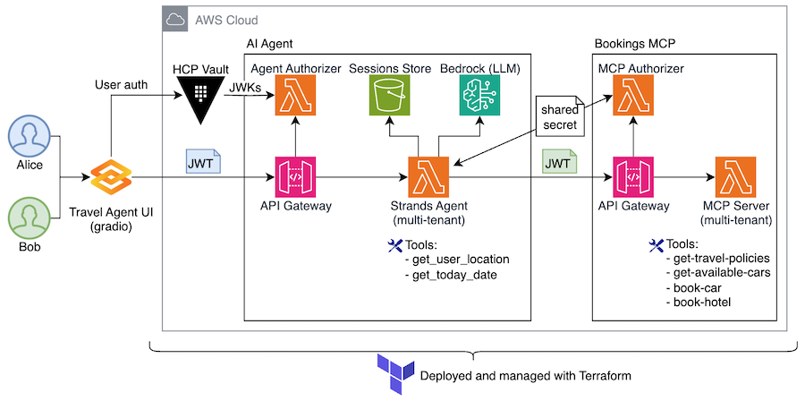
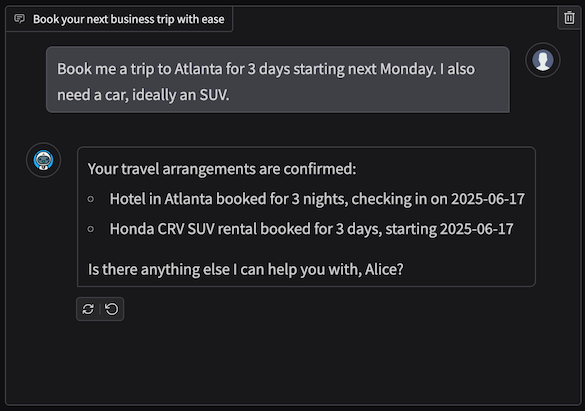

# Strands Agent with MCP Server on AWS Lambda

## Architecture


(See detailed description of components and workflows)

## Prereqs

* AWS CLI
* CDK
* Node.js and Python

## Running the project

### Clone the project 
```bash
git clone https://github.com/aws-samples/sample-serverless-mcp-servers.git
cd sample-serverless-mcp-servers/strands-agent-on-lambda
```

### Install dependencies
```bash
(cd lambdas/agent-authorizer && npm install)
(cd lambdas/mcp-authorizer && npm install)
(cd lambdas/bookings-mcp && npm install)
```

### Deploy to AWS with CDK
```bash
npm install
cdk deploy
```
Make sure to carefully review required IAM permissions. 

### Run post-deploy script
```bash
./prep-web.sh
```

Running this script will
1. Update Cognito users Alice and Bob with passwords. The password is `Passw0rd@`. You will need it to login. 
2. Update `./web/.env` file with configuration required for running Web UI. 

### Run Web UI
```bash
cd web
python3 -m venv .venv             # Create virtual environment
source .venv/bin/activate         # Active virtual environment
pip install -r requirements.txt   # Install dependencies
python app.py                     # Start Web UI app
```

Open `http://localhost:8000/chat/` in your browser

### Login

You will be redirected to Cognito-hosted login screen. 


* Username: `Alice` or `Bob`
* Password: `Passw0rd@`

Once logged in, start asking your AI Agent questions about corporate travel booking, for example

* What cars can I rent? 
* Book me a trip to Paris
* I need to go to Dallas for three days starting next Monday, I also need a car
* Can I rent a Mercedes?



### Clean-up
```bash
cdk destroy
```


